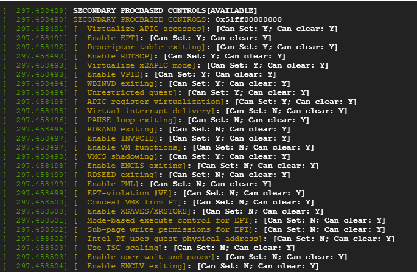

## (CMPE 283) Virtualization Technology Assignment 1: Discovering VMX Features   

#### Jainam Patel
#### 015260349
#### jainamhareshbhai.patel@sjsu.edu

## Questions

## Team Details:
- Assignment done by myself

## Steps:
1) Created a Virtual Machine(VM) on Google Cloud Platform(GCP) making sure the following things:
    - CPU should be Intel brand, personally I used Intel Cascade Lake(Generation 2-N2)
    - Enabled nested virtualization(through CLI `--enable-nested-virtualization`) and used Ubuntu 18.04 LTS.
2) Installed packages such as `unzip, gcc, make, linux-headers-$(uname -r)`. 
3) Referred Intel SDE Volume 3, to find all the capabilities for the following MSRs.
   1) Exit Controls (IA32_VMX_EXIT_CTLS: 0x483)
   2) Entry Controls (IA32_VMX_ENTRY_CTLS: 0x484)
   3) Pinbased Controls (IA32_VMX_PINBASED_CTLS: 0x481)
   4) Procbased Controls (IA32_VMX_PROCBASED_CTLS:0x482)
   5) Secondary Procbased Controls (IA32_VMX_PROCBASED_CTLS2: 0x48B)
   6) Tertiary Procbased Controls (IA32_VMX_PROCBASED_CTLS3: 0x492)
4) After referring to the source code provided `cmpe283-1.c` and `MakeFile`, I created five more structs and constants(defining their HEX) representing other MSRs mentioned above and modified the `detect_vmx_features` to `report_capabilities` for those MSRs.
5) **NOTE:** For MSRs, Secondary Procbased and Tertiary Procbased, make sure to check the ability to set the `Active Secondary Controls(bit-31)` and `Active Tertiary Controls(bit-17)` in the Primary Procbased controls before performing `rdmsr` and `report_capability`. 
6) Make sure the `MODULE_LICENSE("GPL")` is added in the code. 
7) Created a SSH key in my local machine using `ssh-keygen -t rsa -f fileNameHere -C gcpUserNameHere -b 2048` and added the public key(.pub) in the VM instance created. 
8) Using `scp` command, transferred the zip file to the vm. eg. `scp -i ./fileNameOfKeyCreated /path/to/zip/file/here usernameOfVM@externalIPofVM:destination/path/in/vm`.
9) Unzipped the file and in the directory performed make operation.
   1)  Load the module into the kernel `sudo insmod vmx-features.ko`
   2)  Unload the module from the kernel `sudo rmmod vmx-features`
10) To view the output of the module, use `sudo dmesg `.
11) Output of the following steps:

